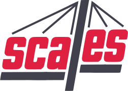
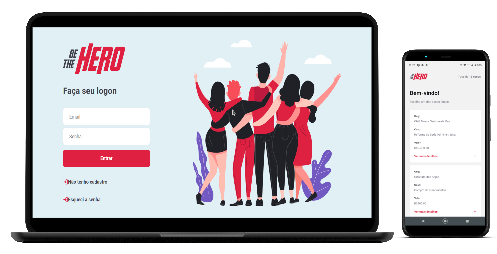
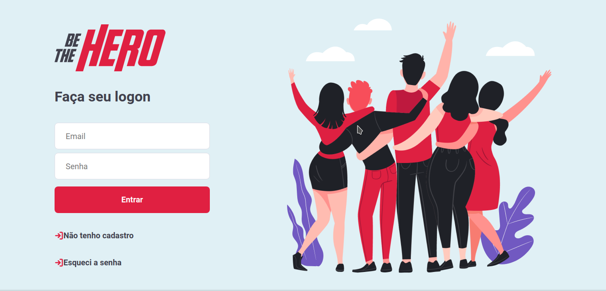
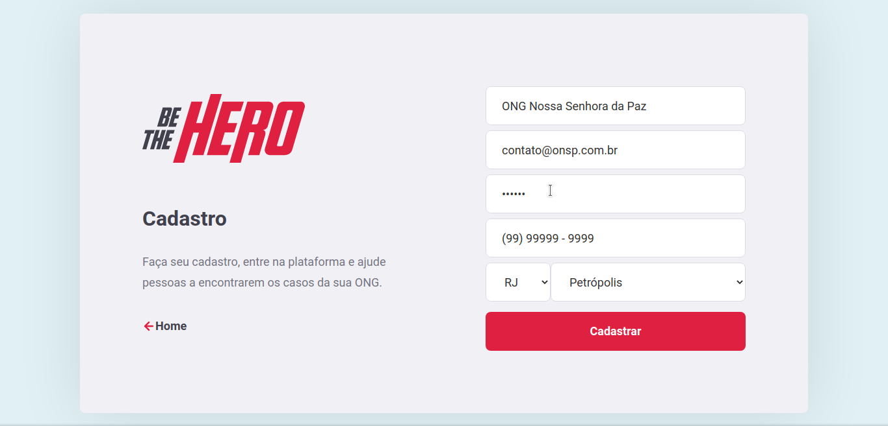
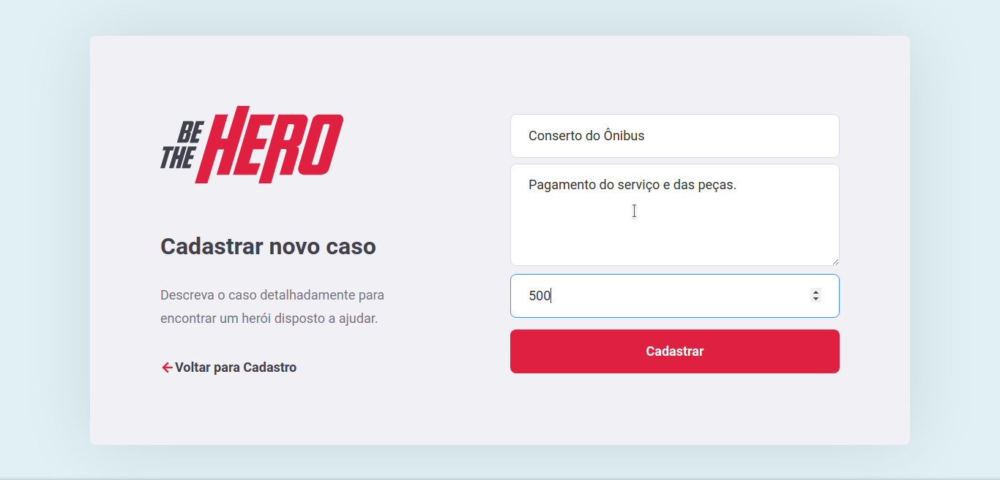
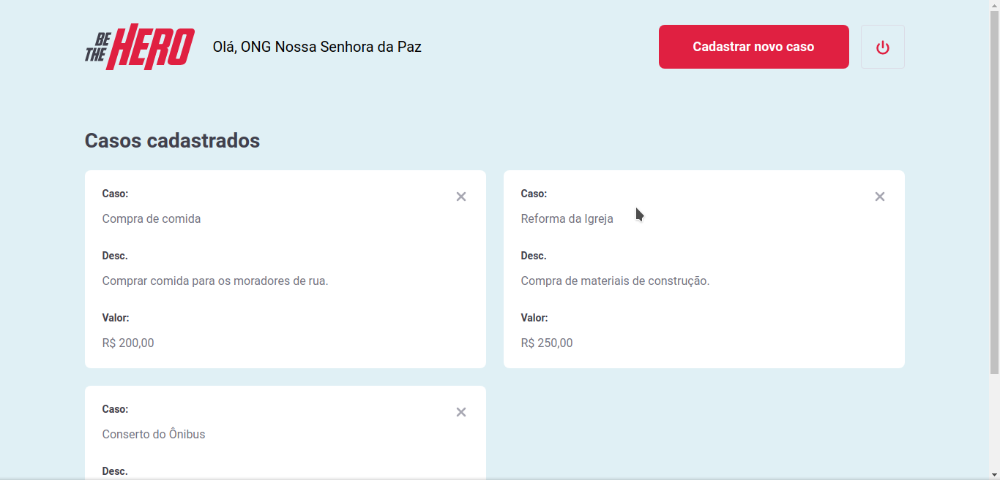
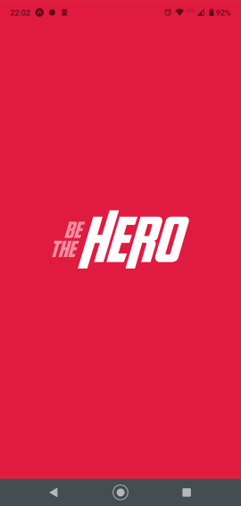
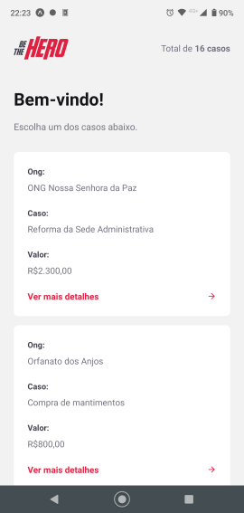
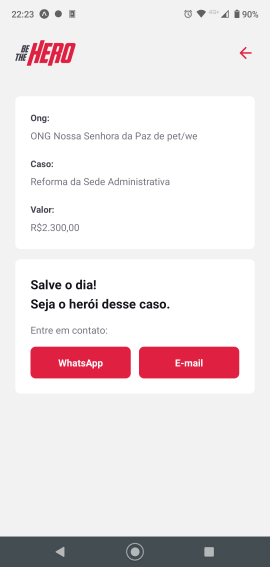
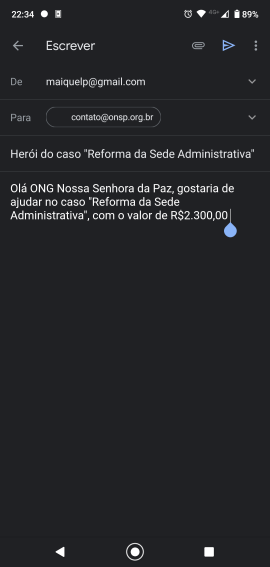

<h1 align="center">
  
</h1>
<p align="center">
  
  
  
  
  <a href="https://github.com/maiquelp/beTheHero/commits/master">
    
  
  </a>
  <!--  -->
 <br>
  <a href="https://www.linkedin.com/in/maiquelp/">
      
  </a> 
  <!-- <a href="https://insomnia.rest/run/?label=beTheHero&amp;uri=https%3A%2F%2Fraw.githubusercontent.com%2maiquelp%2FbeTheHero%2Fmaster%2F.github%2FInsomnia.json" target="_blank"></a> -->
</p>
<strong>
<br>
<p align="center">
    <a href="README.md">Inglês</a>
    ·
    <a href="README-pt.md">Português</a>
</p>

<p align="center">
  <a href="#bookmark-sobre">Sobre</a>&nbsp;&nbsp;&nbsp;|&nbsp;&nbsp;&nbsp;
  <a href="#arrow_up-upgrades">Upgrades</a>&nbsp;&nbsp;&nbsp;|&nbsp;&nbsp;&nbsp;
  <a href="#computer-tecnologias">Tecnologias</a>&nbsp;&nbsp;&nbsp;|&nbsp;&nbsp;&nbsp;
  <a href="#wrench-ferramentas">Ferramentas</a>&nbsp;&nbsp;&nbsp;|&nbsp;&nbsp;&nbsp;
  <a href="#package-instalação">Instalação</a>&nbsp;&nbsp;&nbsp;|&nbsp;&nbsp;&nbsp;
  <a href="#camera_flash-telas">Telas</a>&nbsp;&nbsp;&nbsp;|&nbsp;&nbsp;&nbsp;
  <a href="#memo-licença">Licença</a>
</p>
</strong>
<br>
<p align="center">
    
</p>

## :bookmark: Sobre

O **BeTheHero** tem por objetivo aproximar entidades necessitadas á usuários dispostos a ajudá-las. O backend consiste em uma API Rest rodando em um servidor NodeJS. O frontend foi feito com React e o app mobile com React Native. Este projeto foi implementado durante a **Semana Omni Stack #11** da **[Rocketseat](https://rocketseat.com.br/)**.

<br>

## :arrow_up: Updates

As seguintes alterações foram feitas após a finalização do projeto da RocketSeat:

- Exibição de um spinner nos botões de requisição e carregamento dos casos.
- Migração de CSS modules para Styled-components.
- Adição de uma confirmação para exclusão de casos.
- Aplicação de uma máscara no campo whatsapp do cadastro de Ongs.
- Utilização da API do IBGE para preenchimento dos campos uf e cidade no cadastro de Ongs.
- Envio de e-mail para confirmação do cadastro de Ongs.
- Recuperação de senha.
- Autenticação por e-mail e senha.
- Criação de um favicon.

<br>

## :computer: Tecnologias

-  **[Typescript](https://www.typescriptlang.org/)**
-  **[Node.js](https://nodejs.org/)**
-  **[Express](https://expressjs.com/)**
-  **[Knex](http://knexjs.org/)**
-  **[SQLite](https://www.sqlite.org/)**
-  **[ReactJS](https://reactjs.org/)**
-  **[React Native](http://facebook.github.io/react-native/)**
-  **[Celebrate](https://github.com/arb/celebrate)**
-  **[Expo](https://expo.io/)**
-  **[Axios](https://github.com/axios/axios)**
-  **[Jest](https://jestjs.io/)**
-  **[NodeMailer](https://nodemailer.com/)**
-  **[JWT](https://jwt.io/)**
-  **[Styled-Components](https://styled-components.com/)**

<br>

## :wrench: Ferramentas

- **[VisualStudio Code](https://code.visualstudio.com/)**
- **[Insomnia](https://insomnia.rest/)**
- **[Google Chrome](https://www.google.com/chrome/)**
- **[DBeaver](https://dbeaver.io/)**

<br>

## :package: Instalação

### :heavy_check_mark: **Pré-requisitos**

Os seguintes softwares devem estar instalados:
  
  - **[Node.js](https://nodejs.org/en/)**
  - **[Git](https://git-scm.com/)**
  - **[NPM](https://www.npmjs.com/)**
  - **[Expo](https://expo.io/)** 
  - **[Expo App](https://play.google.com/store/apps/details?id=host.exp.exponent)**

<br>
  
### :arrow_down: **Clonando o repositório**

```sh
  $ git clone https://github.com/maiquelp/beTheHero.git
```

<br>

### :arrow_forward:	**Rodando as aplicações**

- :package: API

```sh
  $ cd backend
  # Dependencies install.
  $ npm install
  # Data base creation.
  $ npm run knex:migrate
  # API start
  $ npm run dev
```

- :computer: Web app

```sh
  $ cd frontend
  # Dependencies install.
  $ npm install
  # Running web app
  $ npm run dev
```

- :iphone: Mobile app

```sh
  $ cd mobile
  # Dependencies install.
  $ npm install
  # Running mobile app
  $ npm start
```

<br>

## :camera_flash: Telas

- Frontend







- Mobile








<br>

## :memo: Licença

Este projeto está sob uma licença **MIT**.


