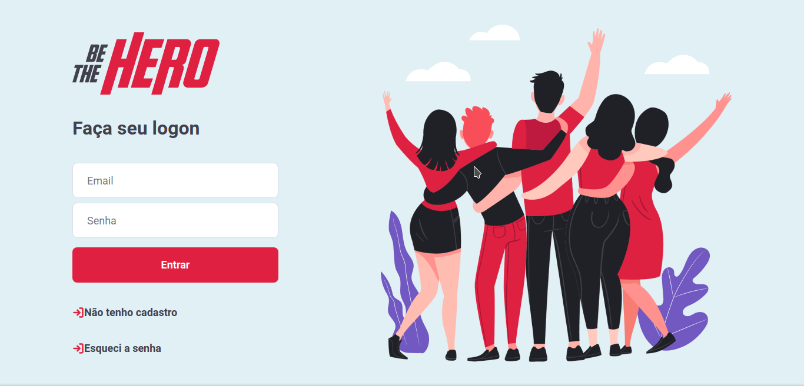
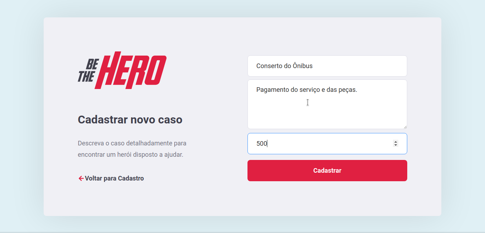
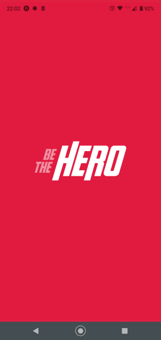
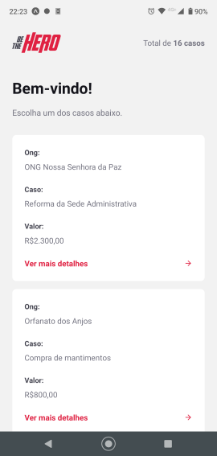
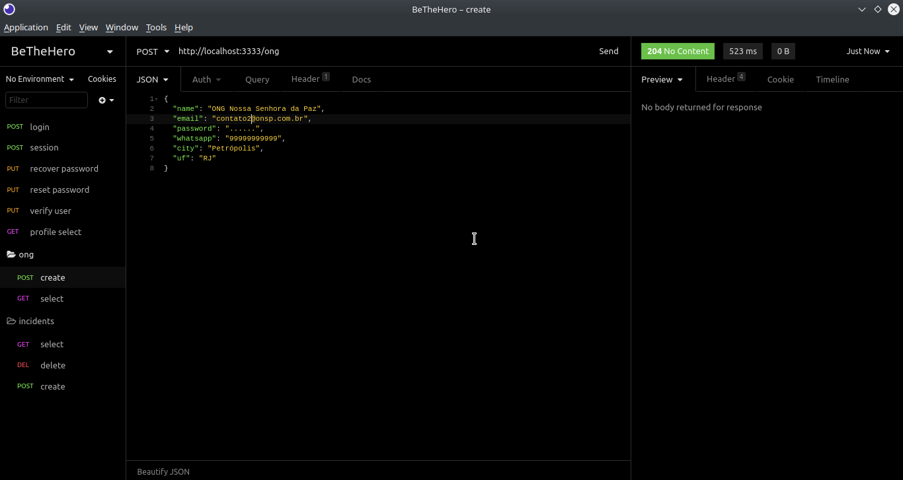
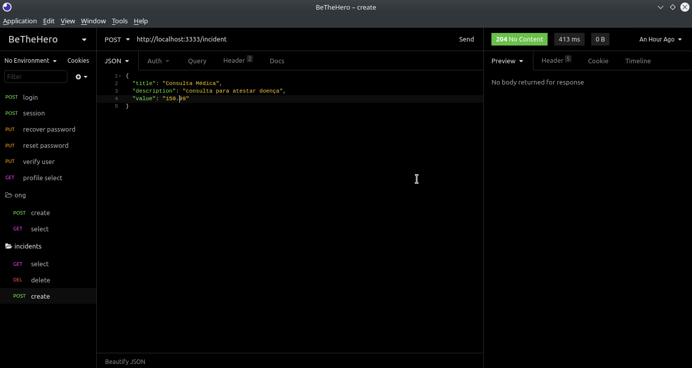

A aplicação tem por objetivo aproximar entidades necessitadas á usuários dispostos a ajudá-las. O backend consiste em uma API Rest rodando em um servidor NodeJS. O frontend foi feito com React e o app mobile com React Native.

# Updates

As seguintes alterações foram feitas após a finalização do projeto da RocketSeat:

- Exibição de um spinner nos botões de requisição e carregamento dos casos.
- Migração de CSS modules para Styled-components.
- Adição de uma confirmação para exclusão de casos.
- Aplicação de uma máscara no campo whatsapp do cadastro de Ongs.
- Utilização da API do IBGE para preenchimento dos campos uf e cidade no cadastro de Ongs.
- Envio de e-mail para confirmação do cadastro de Ongs.
- Recuperação de senha.
- Autenticação por e-mail e senha.
- Criação de um favicon.

# Tecnologias

## Backend
- Servidor: Node.js
- API Framework: Express
- Banco de Dados: SQLite
- Query builder: Knex
- Testes: Jest
- Envio e e-mails: NodeMailer
- Validação: Celebrate
- Autenticação: JWT

## Frontend
- Interface: React
- Estilização: Styled-components

## Mobile
- Interface: React Native
- Serviços: Expo

# Ferramentas
- IDE: Visual Studio Code
- Navegador: Chrome
- Teste da API: Insomnia
- Cliente do Banco de Dados: Beekeeper
 
# Telas

## Frontend

## Mobile

## Backend

